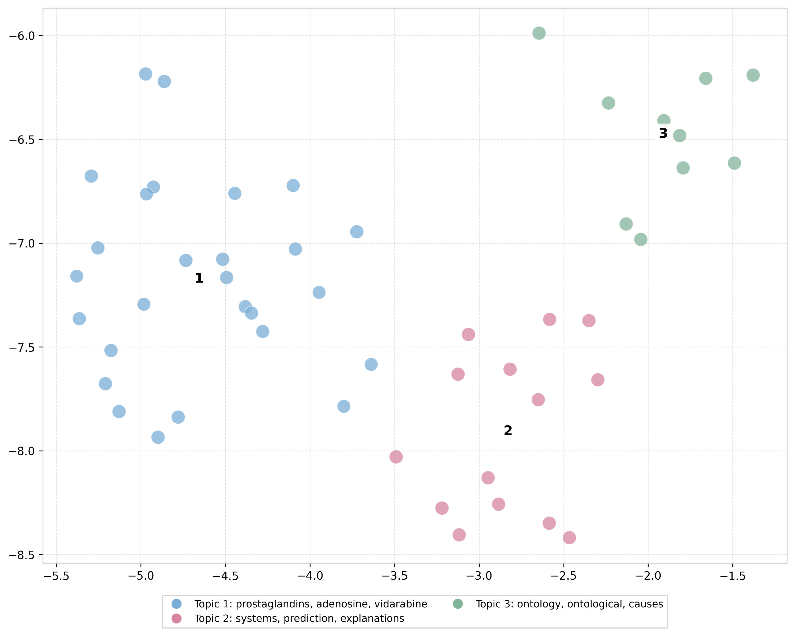

# KG-Explanations-UserStudy

**Explaining Scientific Hypotheses in Drug Development with Knowledge Graphs**  
- Resources, code, and data for the ISWC 2025 paper nr 249 are availabe here.

---

##  Overview

We compare four KG-based explanation methods—**Minerva**, **PoLo**, **REx** and an ontology-free variant **RExLight**—across two drug-discovery tasks:

1. **Drug Repurposing**  
2. **Drug–Target Interaction**

Our evaluation combines:

- **Quantitative link-prediction metrics** (MRR, Hits@k)  
- **A user study** with 11 biomedical researchers rating explanations on scientific validity, completeness, and relevance  
- **Qualitative feedback** (topic modeling & visualization)

---

##  Datasets

| Graph    | Source                                                         |
| -------- | -------------------------------------------------------------- |
| **Hetionet**  | https://github.com/hetio/hetionet                           |
| **PrimeKG**   | https://github.com/mims-harvard/PrimeKG                     |
| **OREGANO**   | https://gitub.u-bordeaux.fr/erias/oregano                   |

---

##  Dataset Statistics

The table below reports overall graph size, then train/validation/test splits for each task.

| Category                    | Metric   | Hetionet  | PrimeKG   | OREGANO   |
| --------------------------- | -------- | --------- | --------- | --------- |
| **Global Stats**            | Triples  | 4 499 850 | 8 096 649 | 1 571 899 |
|                             | Entities |  45 159   | 129 313   |  98 603   |
|                             | Relations|    51     |    35     |    41     |
| **Drug Repurposing**        | Train    |    483    |  7 510    |    117    |
|                             | Valid    |    121    |    939    |     29    |
|                             | Test     |    151    |    939    |     63    |
| **Drug–Target Interaction** | Train    |  5 670    |    —      |  84 214   |
|                             | Valid    |  2 430    |    —      |  36 093   |
|                             | Test     |  3 471    |    —      |  51 560   |

---

##  Methods

We include configuration files and saved models here; full implementations are in their upstream repos:

| Method     | GitHub                                          |
| ---------- | ----------------------------------------------- |
| **Minerva**  | https://github.com/shehzaadzd/MINERVA           |
| **PoLo**     | https://github.com/liu-yushan/PoLo               |
| **REx**      | https://github.com/liseda-lab/REx                |


---

## Qualitative Feedback via Topic Modeling
To complement our quantitative evaluation and expert ratings, we analyzed free-text comments from participants using BERTopic with custom embeddings and clustering. This allowed us to extract recurring themes and concerns from user feedback across explanation methods.

We clustered the feedback using UMAP-reduced embeddings and HDBSCAN, with topic representations generated via KeyBERT. This helped reveal latent concerns such as biological plausibility, path length complexity, and relation interpretability.

<div align="center">  </div>
Each point in the plot represents a participant comment, colored by its assigned topic. Circle sizes reflect model confidence, while numeric labels correspond to the most salient keywords.

The script is available in evaluation/topic_modeling/create_topics.py, with results saved to Excel for further inspection.


## Repository Structure

```text
KG-Explanations-UserStudy/
│
├── datasets/                   # Preprocessed KGs for each task with train, test, dev plus labels 
│   ├── dataset_dr/
│   ├── dataset_dt/
│   └── datasets_labels/
│
├── systems/                # Configs files and saved models for methods for each KG
│   ├── config_files/
│   └── saved_models/
│
├── evaluation/          # User-study materials, topic modeling, user design
│   ├── user_study_forms/
│   ├── topic_modeling/
│   └── user_design/
│
└── README.md               # ← You are here

```


